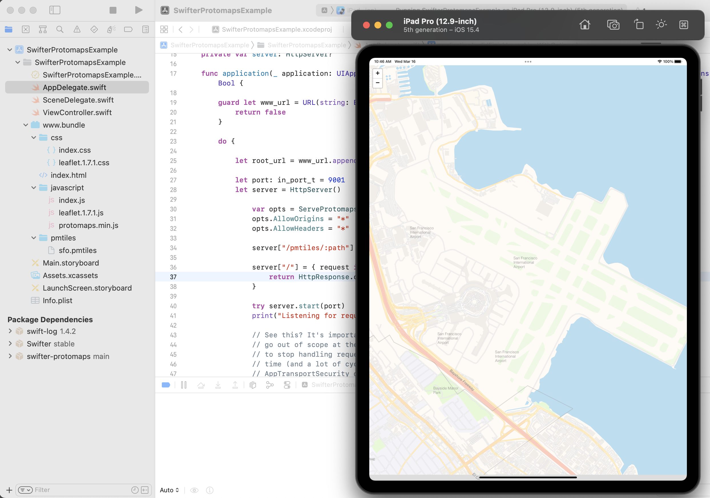

# SwifterProtomaps

Swift package providing methods for serving Protomaps tile databases from [httpswift/swifter](https://github.com/httpswift/swifter) instances.

## Motivation

This package provides a simple `ServeProtomapsTiles` helper method to serve one or more Protomaps tile databases using HTTP `Range` header requests, inclusive of setting any necessary `CORS` headers.

It was designed for use with an iOS application built around `WKWebKitView` views whose HTML/JavaScript code need to load and render local (on device) Protomaps tiles.

It is not designed to be a general purpose function for serving files using HTTP `Range` requests.

For a longer version detailing why we did this please see the [Serving map tiles to yourself using Protomaps and iOS](https://millsfield.sfomuseum.org/blog/2022/03/30/swifter-protomaps/) blog post.

## Example

```
import Swifter
import SwifterProtomaps

do {
            
	guard let root = URL(string: "/path/to/pmtiles") else {
		raise NSException(name:"InvalidURL", reason:"Invalid URL", userInfo:nil).raise()
	}
	
	let port: in_port_t  = 9000
	            
	var opts = ServeProtomapsOptions(root: root)
	opts.AllowOrigins = "*"
	opts.AllowHeaders = "*"
    
	let server = HttpServer()

	server["/pmtiles/:path"] = ServeProtomapsTiles(opts)
	try server.start(port)
	
} catch {
	print("Server start error: \(error)")
}
```

_Note: If you define `server` inside a function or a closure and don't persist the variable globally the HTTP server will stop as soon as the variable goes out of scope. This is obvious if you stop to think about it but sometimes these things aren't obvious and you end up burning a lot of cycles figuring it out all over again. Maybe it's just me..._

And then in your JavaScript code load and use Protomaps as usual, pointing to the server running on `localhost:9000`:

```
        const p = new protomaps.PMTiles("http://localhost:9000/pmtiles/example.pmtiles");
        
        p.metadata().then(m => {
            
            let bounds_str = m.bounds.split(',')
            let bounds = [[+bounds_str[1],+bounds_str[0]],[+bounds_str[3],+bounds_str[2]]]
            
            layer = new protomaps.LeafletLayer({
	            attribution: '',
        	    url:p ,
	            bounds: bounds,
            });
            

            layer.addTo(map);
        });
    }
```

You can see a working example of this in the [sfomuseum/swifter-protomaps-example](https://github.com/sfomuseum/swifter-protomaps-example) package:



## ServeProtomapsOptions

`ServeProtomapsOptions` defines runtime options for serving Protomaps tiles.

```
public struct ServeProtomapsOptions {
    /// Root is the root directory to serve Protomaps tiles from
    public var Root: URL
    /// AllowOrigin is a string containing zero or more allowed origins for CORs requests and responses. Default = "".
    public var AllowOrigins: String
    /// AllowHeaders is a string containing zero or more allowed headers for CORs requests and responses. Default is "".
    public var AllowHeaders: String
    /// Logger is an option swift-logging instance for recording errors and warning. Default is nil.
    public var Logger: Logger?
    /// Optional string to strip from URL paths before processing. Default is "".
    public var StripPrefix: String
    /// Optional value to use System.FileDescriptor rather than Foundation.FileHandle to read data. This is necessary when reading from very large Protomaps databases. This should still be considered experimental as in "It works, but if you find a bug I won't be shocked or anything." Default is false.
    public var UseFileDescriptor: Bool
}
```

Note the `UseFileDescriptor` option. If you are trying to serve the 120GB global tileset from an iOS application you will need to enable this. The default behaviour is to use `Foundation.FileHandle` to open files and a 120GB database will trigger POSIX "Cannot allocate memory" errors.

## AppTransportSecurity

You will need to ensure your application has the following `NSAppTransportSecurity` settings:

```
	<key>NSAppTransportSecurity</key>
	<dict>
		<key>NSAllowsLocalNetworking</key>
		<true/>
		<key>NSExceptionDomains</key>
		<dict>
			<key>localhost</key>
			<dict>
				<key>NSExceptionAllowsInsecureHTTPLoads</key>
				<true/>
				<key>NSIncludesSubdomains</key>
				<true/>
			</dict>
		</dict>
	</dict>
```

## Swift Package Manager

Add the following entries to your `dependencies` block and any relevant `target` blocks.

```
dependencies: [
    	.package(url: "https://github.com/sfomuseum/swift-protomaps.git", from: "0.1.0"),
]
```

```
.target(
	name: "{YOUR_TARGET}",
	dependencies: [
		.product(name: "SwifterProtomaps", package: "swifter-protomaps")
	]
)
```

## swifter-protomaps-server

`swifter-protomaps-server` is a minimal HTTP server for serving Protomaps files (using the `SwifterProtomaps` library).

```
$> swift build && ./.build/debug/swifter-protomaps-server --help
Building for debugging...
[11/11] Applying swifter-protomaps-server
Build complete! (0.99s)
USAGE: swifter-protomaps-server [--root <root>] [--port <port>] [--verbose <verbose>] [--filedescriptors <filedescriptors>]

OPTIONS:
  --root <root>           The parent directory where PMTiles databases should be served from.
  --port <port>           The port to listen on for new connections (default: 8080)
  --verbose <verbose>     Enable verbose logging (default: false)
  --filedescriptors <filedescriptors>
                          Use System.FileDescriptor rather than Foundation.FileHandle to read data. This is necessary when reading from very large Protomaps databases. This should
                          still be considered experimental (default: false)
  -h, --help              Show help information.
```


## Notes

This package requires:

* iOS 14.0 or higher
* MacOS 11.0 or higher.

## See also

* https://github.com/sfomuseum/swifter-protomaps-example
* https://github.com/sfomuseum/swifter
* https://github.com/protomaps/
